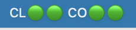
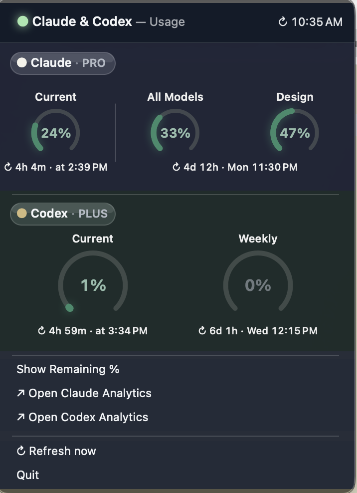
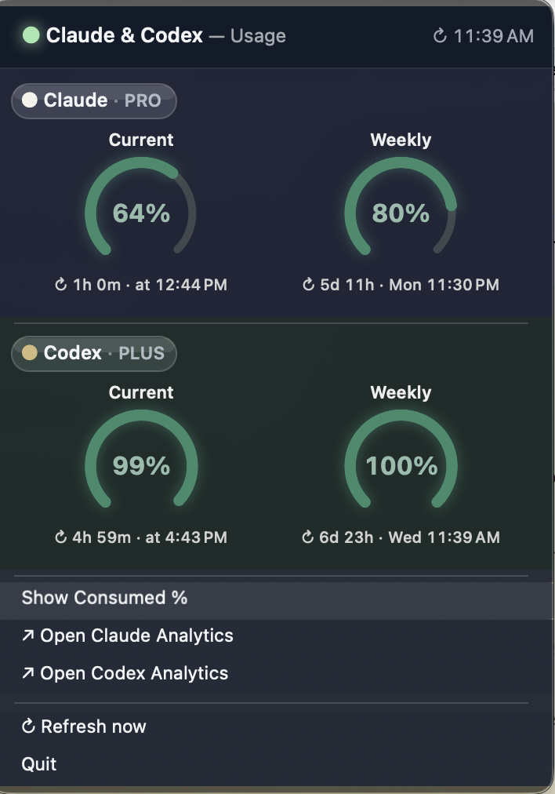

# Claude & Codex Tracker

> **macOS only** — Requires macOS 13 (Ventura) or later on Apple Silicon (M1 or later). Not compatible with Windows, Linux, or Intel Macs.

A macOS menu bar app that shows your real-time usage for **Claude** (Anthropic) and **Codex** (OpenAI) — session limits, weekly limits (All Models and Design separately for Claude), reset countdowns, and threshold warnings.

Runs silently in the background. No Dock icon. Just a menu bar item you click when you need it.

---

## Screenshots

**Menu bar — status dots at a glance:**



**Usage dials — consumed % view (default):**



**Usage dials — remaining % view (`⌘M` to toggle):**



---

## Color indicators

The colored dots in the menu bar and the dial colors follow the same scale:

| Color | Meaning | Threshold |
|---|---|---|
| Green | Healthy — plenty of headroom | 0–49% used |
| Amber | Watch — usage climbing | 50–79% used |
| Red | Critical — approaching limit | 80–99% used |
| Red (solid) | Capped — limit reached | 100% used |

The menu bar shows five dots: `CL ●●●  CO ●●`
- `CL` = Claude · first dot = current usage (5h window) · second dot = weekly (All Models) · third dot = weekly (Design)
- `CO` = Codex · first dot = current usage (5h window) · second dot = weekly

A warning banner also appears inside the menu when any metric crosses 80%.

---

## Prerequisites

| Requirement | Notes |
|---|---|
| macOS 13 or later | Uses Cocoa menu bar and launchctl |
| Apple Silicon Mac (M1 or later) | Build targets `arm64` — Intel Macs are not supported |
| Google Chrome | Must be logged in to `claude.ai` and `chatgpt.com` |
| Python 3 | `python3` must be available in PATH |
| Xcode Command Line Tools | For compiling the Swift binary |

**Install Xcode Command Line Tools** (if not already done):
```bash
xcode-select --install
```

**Install required Python packages:**
```bash
pip3 install browser_cookie3 requests
```

---

## Install

```bash
git clone https://github.com/Sakthimpr/claude-codex-tracker.git
cd claude-codex-tracker
bash build.sh
```

The tracker starts automatically and appears in your menu bar. It also registers a LaunchAgent so it restarts on every login — no manual steps needed.

---

## Verify it's working

Click the menu bar icon. You should see usage dials for Claude and Codex load within a few seconds.

If you see an error or dashes instead of numbers, make sure you are logged in to `claude.ai` and `chatgpt.com` in Chrome, then click **Refresh now**.

---

## Using the app

| Action | How |
|---|---|
| View usage | Click the menu bar icon |
| Switch consumed ↔ remaining % | Click **Switch to Remaining** / **Switch to Consumed** or press `⌘M` |
| See reset time per dot | Hover over any colored dot in the menu bar |
| Open Claude usage page | Click **Open Claude Analytics** |
| Open Codex usage page | Click **Open Codex Analytics** |
| Force a refresh | Click **Refresh now** |
| Quit | Click **Quit** |

> **Tip:** Hovering over each dot in the menu bar shows a tooltip with the metric name, current percentage, and time until reset — without opening the full menu. Claude has three dots (Current · All Models · Design); Codex has two (Current · Weekly).

---

## Troubleshooting

**"Session expired" or auth errors**
- Log in again to `claude.ai` and `chatgpt.com` in Chrome, then click **Refresh now**

**"Claude org not found"**
- Set the environment variable `CLAUDE_ORG_ID` to your org UUID (visible in the `claude.ai` URL under account settings)

**App not appearing after a reboot**
- Run `bash build.sh` to reinstall and reload the LaunchAgent

**Menu bar icon not visible (too many items)**
- The app is still running — the icon is hidden because your menu bar is full
- Run `pgrep claude-tracker` in Terminal — a process ID confirms it is running
- Hold `⌘` and drag less-used icons to the other side of the notch to free up space
- Use [Ice](https://github.com/jordanbaird/Ice) (free, open source) or [Bartender](https://www.macbartender.com) (paid) to reveal and manage hidden menu bar icons

**macOS blocked the app (Gatekeeper)**
- Right-click the app → **Open** → **Open anyway** — this is a one-time step

---

## Uninstall

```bash
launchctl unload ~/Library/LaunchAgents/com.sakthivel.claudetracker.plist
rm ~/Library/LaunchAgents/com.sakthivel.claudetracker.plist
rm ~/.local/bin/claude-tracker
rm -rf ~/.claude-tracker
rm -rf /Applications/Claude_Codex_Tracker.app
```

---

## Mobile access (optional)

View your usage on any device — phone, tablet, or browser — via a hosted web page that mirrors the Mac app dials in real time.

**How it works:** The Mac tracker pushes a snapshot to [Supabase](https://supabase.com) after every fetch. A static web page (deployed to [Vercel](https://vercel.com) or [Netlify](https://netlify.com)) reads from Supabase and renders the dials. Data is at most 2 minutes old.

### Setup

**1. Create the Supabase table**

In your Supabase project → SQL Editor, run:

```sql
create table tracker_snapshot (
  id   int  primary key,
  data text not null,
  updated_at timestamptz not null default now()
);

alter table tracker_snapshot enable row level security;
-- anon users (web page): read-only
create policy "anon read" on tracker_snapshot for select using (true);
-- writes require service_role key (Mac daemon only — never exposed in the browser)
create policy "service_role upsert" on tracker_snapshot for insert
  with check (auth.role() = 'service_role');
create policy "service_role update" on tracker_snapshot for update
  using (auth.role() = 'service_role');
```

**2. Add your Supabase credentials to the Mac**

Find your Project URL and keys in Supabase → Settings → API Keys:
- **URL** — project URL
- **anon/public key** — goes into `web/config.js` (read-only, safe to expose)
- **service_role key** — goes into `~/.claude-tracker/supabase.json` (write access, never expose)

```bash
mkdir -p ~/.claude-tracker
cat > ~/.claude-tracker/supabase.json <<'EOF'
{
  "url": "https://YOUR-PROJECT.supabase.co",
  "service_role_key": "YOUR_SERVICE_ROLE_KEY"
}
EOF
chmod 600 ~/.claude-tracker/supabase.json
```

Then restart the tracker:

```bash
bash build.sh
```

**3. Deploy the web page**

- Fork or clone this repo
- In **Vercel**: import the repo — leave root directory as `/` (the included `vercel.json` handles everything)
- In Vercel → **Settings → Environment Variables**, add:
  - `SUPABASE_URL` — your project URL (e.g. `https://xxxx.supabase.co`)
  - `SUPABASE_ANON_KEY` — your anon/public key
- Deploy — Vercel runs `scripts/generate-web-config.sh` at build time, which writes `web/config.js` from those env vars. The key never touches git.

**4. Add to your phone's home screen**

Open the deployed URL in Safari → tap the Share button → **Add to Home Screen**. It opens as a standalone app with no browser chrome.

---

## How it works

| Layer | File | Role |
|---|---|---|
| UI | `src/native/Launcher.swift` | Menu bar app — dials, colors, warning banners |
| Data | `src/python/tracker_data.py` | Background daemon — fetches usage from APIs |
| Shared state | `~/.cache/claude-codex-tracker/data.json` | Written by Python, read by Swift every 10s |
| Mobile sync | Supabase `tracker_snapshot` table | Python pushes JSON after every fetch cycle |
| Mobile UI | `web/index.html` | Static page — SVG dials, auto-refreshes every 120s |

- **Auth:** Claude's API accepts cookie-authenticated requests directly. Codex requires a Bearer token obtained from `chatgpt.com/api/auth/session` using your Chrome session.
- **Refresh intervals:** Every 2 minutes normally, every 1 minute when at the usage limit.

---

## Privacy

This app reads Chrome cookies for `claude.ai` and `chatgpt.com` only. If mobile access is enabled, usage percentages and reset times are pushed to your own Supabase project — no third-party analytics, no personal data. If mobile is not configured, all data stays entirely on your machine.

---

## License

MIT © Sakthivel Ramasamy
